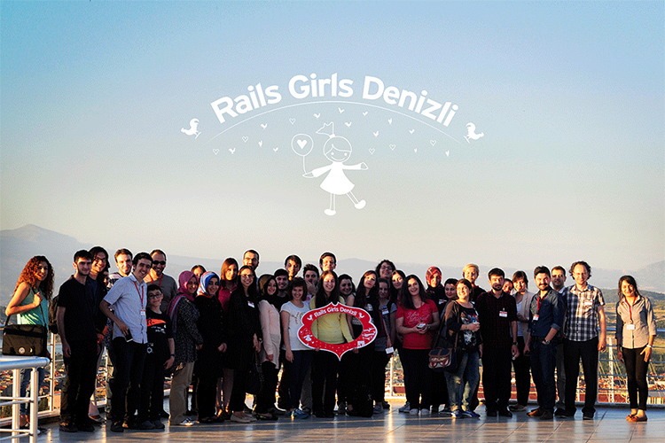
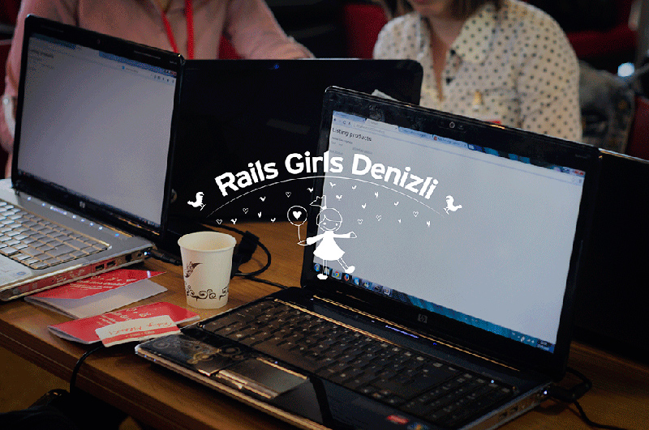

Rails Girls, **Finlandiya** kökenli bir  topluluktur. Amacı, dünyadaki Rails bilen ve Rails ile geliştirme yapan kadın sayısını arttırmaktır.
Dünyanın birçok şehrinde düzenlenmiş veya düzenlenmeye devam eden, Rails Girls etkinliğinin Denizli' deki ev sahipliğini üstlenmeye karar verdik. Peki, Nasıl?

14 - 15 Mart tarihlerinde düzenlenen [Rails Girls Ankara](http://railsgirls.com/ankara), bize Rails Girls Denizli etkinliğini düzenlemek için ilham kaynağı oldu diyebilirim. Denizli' de ben ve iş arkadaşlarım - [Safiye Sepetçi](https://twitter.com/safiyesepetci)
ve [Clara Isabel Pantoja](https://twitter.com/klapancg) - böyle bir etkinlik tüm dünyada düzenleniyorsa, Denizli' de neden olmasın diye düşündük ve [Rails Girls](http://railsgirls.com/)
sayfasını incelemeye başladık. Ardından [Rails Girls](http://railsgirls.com/) ekibi ile iletişime geçtik, gerekli formu doldurup gönderdik ve bekleme sürecine geçtik.
Biz bu süreci beklerken daha önce [Rails Girls İstanbul](http://railsgirls.com/istanbul) etkinliğini gerçekleştiren [Kader Sucuk](https://twitter.com/sucuklukfasulye) ve [Ender Ahmet Yurt](https://twitter.com/enderahmetyurt) bizimle iletişime geçip
her türlü yardım ve destekte bulundular.

Ardından Rails Girls organizatörlerinden [Linda Liukas](https://twitter.com/lindaliukas) bizimle iletişime geçip, rails girls github reposunu bizimle paylaştı.
Biz de [Rails Girls Denizli](http://railsgirls.com/denizli) sayfasını uygun metodlara göre düzenlemeye başladık. Düzenlediğimiz siteyi direk github rails girls reposuna gönderiyorduk.
Uluslararası bir etkinliği şehrinizde yapmanın verdiği heyecan paha biçilemezdi.

Etkinliğin gerçekleşeceği yer için Denizli' nin Silikon Vadisi olarak adlandırılan [Pamukkale Teknokent AŞ](http://www.pauteknokent.com.tr/) Konferans salonu için
Sayın [Doç.Dr. Hasalettin Deligöz](http://hdeligoz.pau.edu.tr/?lang=en) ile konuştuk ve Hasalettin Bey uluslararası bir etkinlikte bulunmaktan mutluluk duyacağını bizlere her türlü yardımda ve destekte
bulunacağını belirtti, böylece etkinlik yerini Pamukkale Teknokent Konferans salonunda gerçekleştirmeye karar verdik.

Tabi böyle bir etkinlik için sponsorlar olmazsa olmazlardan, [Bulutfon](https://bulutfon.com/), [Netinternet](http://www.netinternet.com.tr/) ve
[Lab2023](http://lab2023.com/) sponsorlarımız olmayı kabul ettiler.

Organize olduktan sonra, sıra mentörleri kararlaştırmak gerekiyordu. Aslında mentörleri kararlaştırırken çok fazla zorlanmadık, nedeni ise çalıştığım
[Lab2023](http://lab2023.com/) firmasında rails ile uygulama geliştiriliyor olması işimizi kolaylaştırdı.

[Rails Girls Denizli](http://railsgirls.com/denizli) sayfasını tasarlarken logomuzu belirlemek gerekiyordu, sonuçta uluslararası bir etkinlikte Denizli' yi Dünya' ya
ufakta olsa tanıtmayı amaçlıyordu, bu nedenle "Denizli'yi en iyi ne temsil eder?" konusu üzerinde düşünmeye başladık. "Denizli" deyince insanların aklına direk horozu, Hierapolis antik kenti ve Pamukkale Travertenleri gelmekteydi.
Bu çıkarımlardan yola çıkarak logomuzu oluşturduk.

Etkinlikte sadece kodlama değil aynı zamanda kadınlara yönelik ilgi çekici konularında olması gerektiği düşüncesindeydik.Bu nedenle "Kadınların iş hayatındaki yeri"
başlıklı bir sunum için, bu sunumu Denizli' de en iyi aktarabilecek bayanlardan biri olan Sayın [Vildan Çaputçu](http://www.anjeads.com/tasarimcilar/vildan-caputcu) ile
iletişime geçtik. Vildan Hanım bizi kırmayıp "Kadınların iş hayatındaki yeri" konulu sunumunu hazırladı. Ayrıca etkinlikte "Fotograf" konulu bir sunum için [Serdar Yağcı](https://twitter.com/Sevliya)
ile iletişime geçtik. Serdar Bey' in hazırladığı sunum gerçekten büyüleyiciydi.

Afişlerin Hazırlanması, sticker gibi diğer materyalleri rails girls sunduğu için bu konuda zorlanmadık. Site tamamlandıktan sonra [Rails Girls Ankara](http://railsgirls.com/ankara) organizasyon ekibinden [Sezen Balibeyoğlu](https://twitter.com/SezenBalibeyolu)
ile iletişime geçip duyuru ve süreçlerin nasıl olması konusuna dair bilgi aldık.

Etkinlikte farklı sektördeki kadınların rails kodladıklarını gördükten sonra sanırım etkinlik belirtilen amacına ulaştığını düşünüyorum.
Başta bu organizasyonda bizlere desteği ve yardımlarından ötürü sponsorlarımıza [Bulutfon](https://bulutfon.com/), [Netinternet](http://www.netinternet.com.tr/)
ve [Lab2023](http://lab2023.com/), bütün sorularımıza cevap veren [Kader Sucuk](https://twitter.com/sucuklukfasulye)' a, [Ender Ahmet Yurt](https://twitter.com/enderahmetyurt)' a, [Sezen Balibeyoğlu](https://twitter.com/SezenBalibeyolu)' na,
etkinlik yeri için Sayın [Doç.Dr. Hasalettin Deligöz](http://hdeligoz.pau.edu.tr/?lang=en) e, değerli sunumları ile bizleri bilgilendiren  [Vildan Çaputçu](http://www.anjeads.com/tasarimcilar/vildan-caputcu) ve [Serdar Yağcı](https://twitter.com/Sevliya)' ya, katılımcılara, değerli mentörlerimize ve emeği geçen herkese teşekkürlerimizi sunarız .

Rails Girls Denizli etkinliği ile ilgili [resimlerin tamamını Flicker hesabımızdan](https://www.flickr.com/photos/122188945@N05/sets/72157644393068979/) görebilirsiniz.