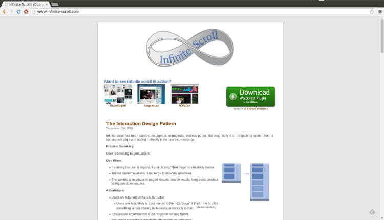
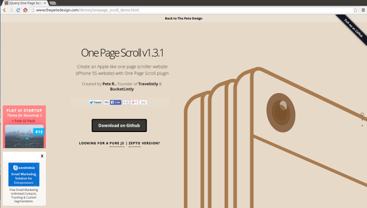
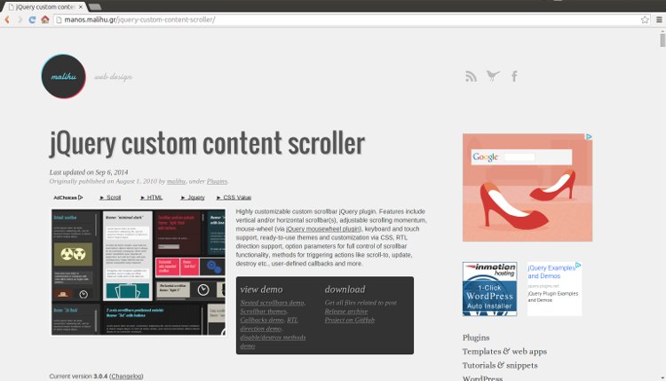
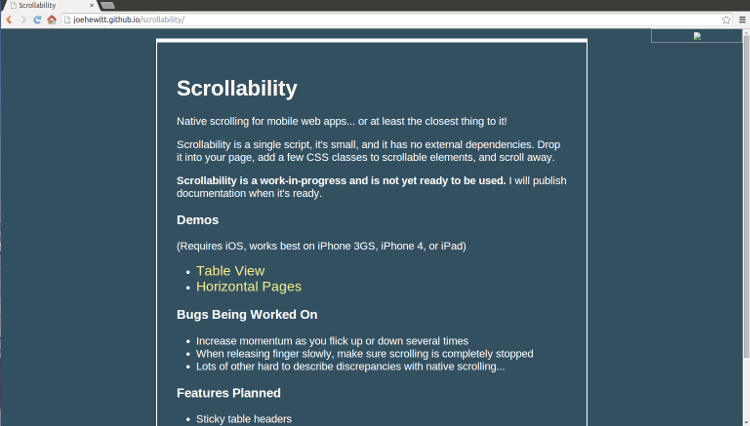
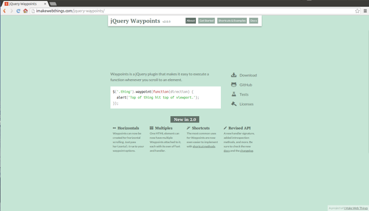
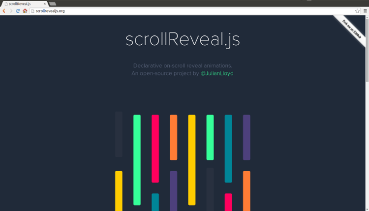

Javascript scroll page plugins provide to like,

- scroll
- parallax
- animations
- rotations
- drawing line or arcs ...etc

we can use this properties for our pages for entertainment pages. 
Let' s examine js plugins ,  

1- [infinite-scroll](http://www.infinite-scroll.com/)

- `Infinite-scroll` provide to unpaginate and endless pages for web pages
- For detail on [GitHub page](https://github.com/paulirish/infinite-scroll)

2- [One-page scroll](http://www.thepetedesign.com/demos/onepage_scroll_demo.html)

- Provide scroll page with parallax on one page.
- You can create game or entertainment page with this plugins
- For detail on [GitHub page](https://github.com/peachananr/onepage-scroll)

3- [Scroll Magic](http://janpaepke.github.io/ScrollMagic/)

- Provide animation for all things (text, image, video ...etc)
- Also synchronize an animation, infinitely scrolling  page. 
- For detail on [GitHub page](https://github.com/janpaepke/ScrollMagic)

4- [Custom content scroller](http://manos.malihu.gr/jquery-custom-content-scroller/)

- High customizable custom scrollbar 
- Features include vertical, horizontal, scrolling, drawing ...etc
- For detail on [GitHub page](https://github.com/malihu/malihu-custom-scrollbar-plugin)

5- [Scrollability](http://joehewitt.github.io/scrollability/)

- Provide scrolling for mobile devices .
- For detail on [GitHub page](https://github.com/joehewitt/scrollability)

6- [WayPoints](http://imakewebthings.com/jquery-waypoints/)

- Provide to status of webpage like horizontal or vertical for one page or multiple pages
- For detail on [GitHub page](https://github.com/imakewebthings/jquery-waypoints)

7- [Scroll Reveal](http://scrollrevealjs.org/)

- Provide to scroll animation for page
- For detail on [GitHub page](https://github.com/julianlloyd/scrollReveal.js)

8- [Scroll Path](http://joelb.me/scrollpath/)

- it offer custom scroll paths,
- provide to rotations and draw line or arcs
- For detail on  [GitHub page](https://github.com/JoelBesada/scrollpath)

9- [Super Scrollorama](http://johnpolacek.github.io/superscrollorama/)

- It offer may properties like pinning, scale, slide, bounce ...etc animations for web-page.
- For detail on [GitHub page](https://github.com/johnpolacek/superscrollorama)

10- [Sly](http://darsa.in/sly/)

- provide advanced one-directional scrolling with item based navigation support.
- For detail on [GitHub page](https://github.com/darsain/sly)

11- [Scroll Pane](http://jscrollpane.kelvinluck.com/)

- provide to converts a browsers default scrollbars for html structure that can be easily skinned with css.
- For detail on [GitHub page](https://github.com/vitch/jScrollPane)

12- [Skrollr](http://prinzhorn.github.io/skrollr/)

- Stand-alone scrolling-parallax js library for mobile devices 
- without jquery, only javascript.
- For detail on [GitHub page](https://github.com/Prinzhorn/skrollr)

13- [iSroll](http://iscrolljs.com/)

- provide to scroll with parallax, also it offers 3D scroll animations.
- For detail on [GitHub page](https://github.com/cubiq/iscroll)

The best open source library for `scroll-page` like above.

I hope helped to you .
