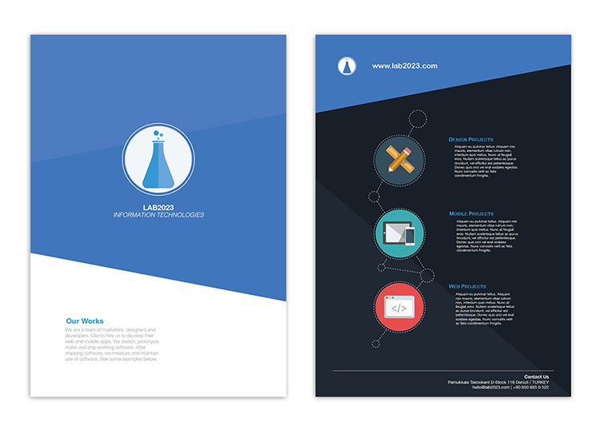
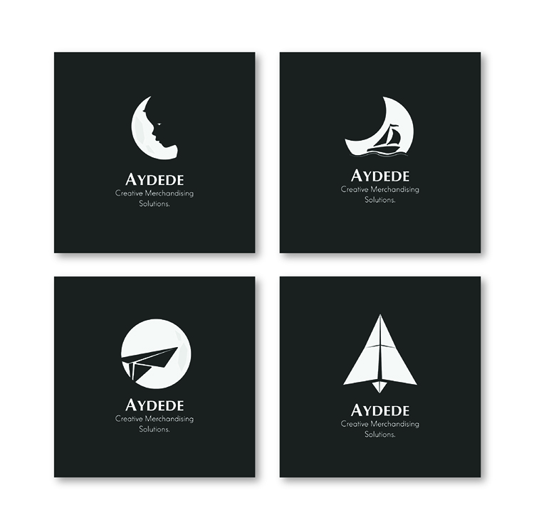

Originally ‘Flat UI design’ is a design style trend that becomes from the interfaces and mobile modern digital designs. This minimalistic style is an integration of basic elements, flat shapes and good practices on graphic diagramming, result is not only a very attractive design, but also optimizing web development and completely adapted to the HTML5 standards.

Flat design is focused on one particular design principle called ‘form and function’ or ‘form and content’, one of the most relevant concepts in the visual language. Design means make a plan or convention for any creation or construction, in this way we can understand that the main importance for a designer is the final purpose or application of this design. and in this case the optimization of the design for development issue is a basic need, a need that Flat design trend is solving in a highly creative way.

It is not the first time that computer graphics explore the deep relation between aesthetics and functionality in the design, but nowadays this trend tells us to realize that functionality is the true face of the aesthetic, because simple is perfect. Concept about simplicity is hard to interiorize because this doesn't mean that it is going to be easier for designers, actually it is exactly the opposite, a real paradox: less elements more strategy, more visual techniques applied. 

Here are some advices and techniques for Flat design creations:

### Diagramming 

The proportioned order of the elements, being aware about your empty spaces in the composition and use a grid is the key for the best diagramming practices. placing the elements in the correct way will save space, give more clear information and make your design look professional.

### Simplicity

Decorative elements are completely not necessary, use contents, color, typography and flat shapes for give the perfect appearance, you don't need useless graphics making noise in your composition. Erase effects, complicated shadows, unnecessary gradients, don't be afraid to do a clean job.

### Typography

Give typography the importance it deserves, it is not just text, typography is a design element as it can be colors, shapes, photographs, icons and others. choose the right typography, go for the more readable ones. Sans serif is preferred for Flat design.

### Color

Flat design is nothing without this terrific color schemes representative of this style, if you are not sure about how to mix colors in an appropriate way, there are already a lot of sources that you can use from the internet. but always remember to plan your palette before start.

For more info about color you can review [How to choose right colors for web design](/how-to-choose-right-colors-for-web-design.html).