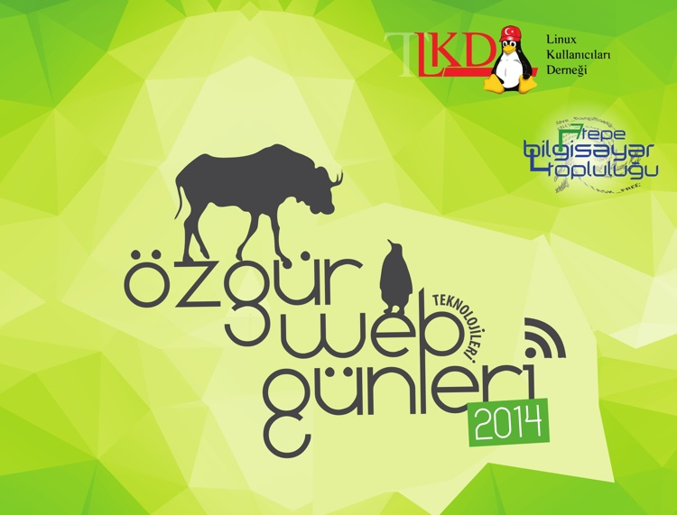

Bu yıl 5. kez düzenlenecek olan Özgür Web Teknolojileri Günleri 2014, **05 – 06 Aralık’ta İstanbul Yeditepe Üniversitesi**’nde gerçekleştirilecektir.

Önceki yıllarda da düzenli olarak katıldığımız etkinliğe bu sene Lab2023 olarak 5 farklı sunum içeriği ile katkı sağlıyoruz.

Bunun yanı sıra stant sponsoru da olduğumuz etkinlikte sizleri de aramızda görmekten ve tanışıp sohbet etme fırsatı bulmaktan mutluluk duyacağız.

Etkinlikte yer alan sunumlarımıza ait detaylar aşağıdaki gibidir.

### 07 Aralık 2014 - Cumartesi

#### Kerem Can Karakaş Salonu

* 17:00-17:20 - Design Processes and Resources for Successful Web Applications – Clara Isabel Pantoja Muñoz – Kamila Gareeva (Kısa Bildiri)
* 17:20-17:25 - All you have to know about cc (creative commons) – Clara Isabel Pantoja Muñoz (Hızlı Konuşma)
* 17:25-17:30 - Animation techniques and principles to make your web applications or designs more attractive. – Kamila Gareeva (Hızlı Konuşma)

#### Dennis Ritchie Salonu

* 10:25-10:50 - Ruby on Rails 4.2 ile gelen kullanışlı yenilikler – Tayfun Öziş Erikan (Kısa Bildiri)
* 16:25-16:50 – JAX-RS ile RESTful Java Web Servisleri – Murat Kemal Baygün (Kısa Bildiri)

Etkinlikle ilgili tüm detaylara aşağıdaki adreslerden ulaşabilirsiniz.

**Detaylı etkinlik programı**

[http://www.ozgurwebgunleri.org.tr/2014/etkinlik-programi](http://www.ozgurwebgunleri.org.tr/2014/etkinlik-programi)

**Etkinlik web sitesi adresi**

[http://www.ozgurwebgunleri.org.tr/2014](http://www.ozgurwebgunleri.org.tr/2014)

İlgililere duyurulur.

