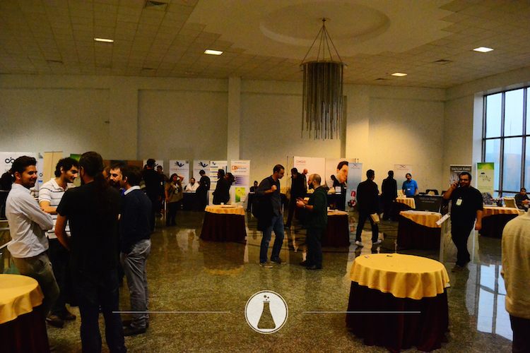

Özgür Web Teknolojileri Günleri 2014’e katılacağımızı 2 Aralık’ta [duyurmuş](/2014-12-02-5-farkli-sunum-ile-katki-sagladigimiz-ve-stant-sponsoru-oldugumuz-ozgur-web-teknolojileri-gunleri-2014-e-davetlisiniz.html) ve sizleri de davet etmiştik. 05-06 Aralık’ta İstanbul Yeditepe Üniversitesi’nde 5. kez düzenlenen etkinlikte stant sponsoru olarak yerimizi aldık. Önceki yıllarda olduğu gibi, bu yıl da etkinlikte olmaktan büyük keyif duyduk.

Etkinlik alanındaki diğer stantları dolaştık, standımıza uğrayanları karşıladık, konuştuk, bilgi aldık, bilgi verdik, aydınlandık. Etkinlik boyunca keyifli anlar yaşadık, dostlarımızla buluştuk, Özgür Yazılım’ı destekleyen yeni dostlarla tanıştık.

Etkinlik programı olarak 2 gün boyunca birbirinden değerli kişiler, çeşitli seminerler düzenlediler ve bildiriler sundular. Mümkün oldukça bu seminer ve bildiri sunumlarına katıldık, sunulan bilgilerden faydalandık. Ekibimizden arkadaşlarımızın hazırladığı kısa bildiri ve hızlı konuşmaları da bu program içinde sizlerle buluşturma fırsatı bulduk.

Lab2023 olarak yaptığımız sunumlara katılıp yanımızda olan siz dostlarımıza teşekkür ederiz. Katılma fırsatı bulamamış ya da tekrar incelemek isteyenler, sunumlarımıza aşağıdaki bağlantılardan erişebilirler.

### Ekibimizin yaptığı sunumlar

 * [Ruby on Rails 4.2 İle Gelen Kullanışlı Yenilikler](https://speakerdeck.com/tayfunoziserikan/ruby-on-rails-4-dot-2-ile-gelen-kullanisli-yenilikler) - Tayfun Öziş ERİKAN
 * [Design Processes and Resources for] (https://speakerdeck.com/claraisabelpantoja/design-processes-and-resources-for-successful-web-applications)  [Successful Web Applications] (https://speakerdeck.com/kamilala/design-processes-and-resources-for-successful-web-applications) - Clara Isabel Pantoja Muñoz - Kamila Gareeva
 * [All about creative commons] (https://speakerdeck.com/claraisabelpantoja/all-about-creative-commons) - Clara Isabel Pantoja Muñoz
 * [Animation techniques and principles to make your web application designs more attractive.] (https://speakerdeck.com/kamilala/web-animation)- Kamila Gareeva
 * [JAX-RS ile RESTful Java Web Servisleri] (https://speakerdeck.com/baygunm/jax-rs-ile-restful-java-web-servisleri) - Murat Kemal BAYGÜN

Etkinlik programı kapsamında aynı zamanda, Türkiye’de organize olmuş Ruby, PHP ve Python grupları için birlikte çalışma yapabilmeleri ve tanışmaları için topluluk çalışma toplantıları da yapıldı. Biz de, gönül verdiğimiz Ruby için programda olan Ruby Topluluğu Çalışma Toplantısı’nda katılımımızı yaptık, bu çalışma sonucunda toplulukta beraberce aşağıdaki kararları alıp, sorumluları atadık.

 * Meetup.com üzerinde Ruby Türkiye grubu oluşturulması. (Serdar Doğruyol)
 * S.S.S. hazırlanması ( İlk olarak 10 Madde halinde ) (Eyüp Atiş, Kader Sucuk)
 * Sosyal Medya Hesaplarının Yönetimi (Kenan Polat)
 * Podcast’lerin oluşturulması (Serdar Doğruyol, Ender Ahmet Yurt)
 * İş ilanları ve firmalar için erişim sayfası hazırlanması (Kader Sucuk)
 * Etkinlik Takviminin Ruby Türkiye sitesine eklenmesi (Serdar Doğruyol)
 * Wikipedi’de grupla ilgili bir madde oluşturulması (Ekrem Karaca)
 * Grup manifestosu oluşturulması (Kader Sucuk, Serdar Doğruyol, Tayfun Öziş Erikan)
 * Ruby Türkiye domain’in düzenlenmesi (Onur Özgür Özkan)

Katılımlarınız için tekrar teşekkür eder, Özgür Web Teknolojileri 2015’te ve diğer etkinliklerde tekrar buluşabilmeyi dileriz.

[Özgür Web Teknolojileri 2014] (http://www.ozgurwebgunleri.org.tr/2014/) ve [etkinlik programı] (http://www.ozgurwebgunleri.org.tr/2014/etkinlik-programi)
