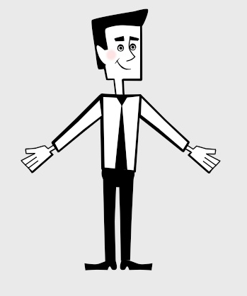
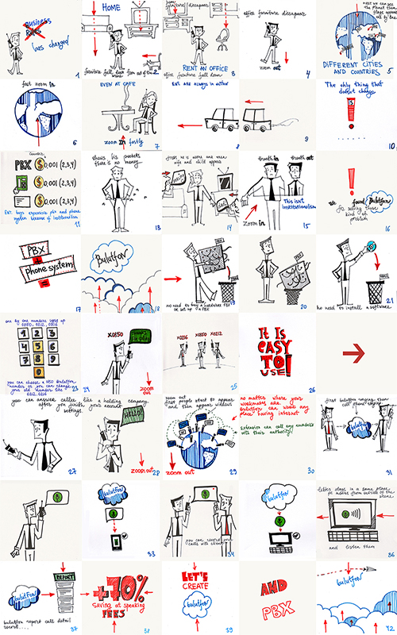
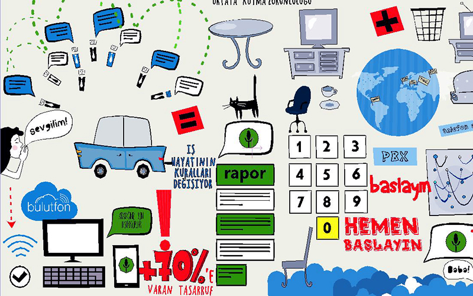
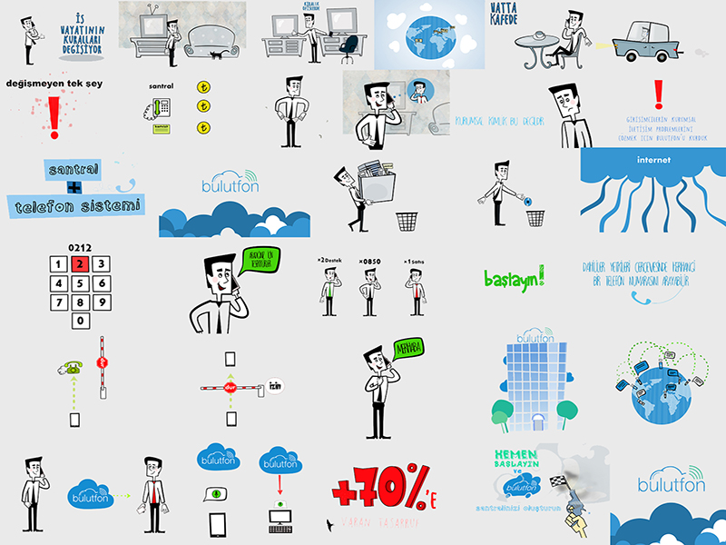

В этой статье я расскажу вам о поэтапном создании рекламного ролика.

1. этап – рождение сюжета;
2. этап – моделирование главного персонажа;
3. этап – создание комикса;
4. этап – превращение главного персонажа в марионетку при помощи «костей» в специальной анимационной программе;
5. этап – создание всех объектов, которые будут использованы при анимации;
6. этап – анимирование;
7. этап – озвучивание анимации;
8. этап – подборка музыки для фона;
9. этап – объединение анимации, музыки и озвучки.

### 1 этап – рождение сюжета…

История рассказывает нам о компании Bulutfon, обо всех ее существующих продуктах, сервисах и инновационных проектах, позволяющих сделать бизнес-процесс своих клиентов удобнее и проще.

### 2 этап – моделирование главного персонажа…

Моделируя главный персонаж, мы хотели, чтобы он получился жизнерадостным, умным, молодым, предприимчивым бизнесменом с обаятельной улыбкой и добрыми глазами. Кроме того, мы сделали его образ, приближенным к реальности, с человеческими пропорциями.

### 3 этап – создание комикса…

После того, как история известна и главный персонаж готов, мы перешли к следующему ответственному этапу – созданию комикса. В нём изложена главная идея каждого отдельного предложения компании, краткое анимированное объяснение с целью сделать понятным предназначение того или иного продукта. Наш комикс получился кратким и очень ёмким.

Для упрощения работы мы использовали примечания – небольшие заметки, объясняющие мелкие детали, как, например, настроение персонажа и т.д., стрелки, чтобы видеть движение персонажа внутри отдельного плана. Вот что у нас получилось:

### 4 этап – превращение главного персонажа в марионетку при помощи «костей» в специальной анимационной программе…

После того, как работа над комиксом закончена и сделаны все поправки, мы перешли к следующему этапу – превращению нашего персонажа в марионетку. Мы создали ему «скелет», помогающий управлять героем во время анимации. Наш персонаж может разговаривать, моргать и менять выражение глаз, может удивляться, быть грустным и смеяться. Как всякий мультипликационный герой, он очень пластичен и гибок.

### 5 этап – создание всех объектов, которые будут использованы при анимации…

Мы подготовили все необходимые объекты, которые использовались в ходе анимирования. Для некоторых элементов мы создали «кости», поскольку они также участвуют в анимации. Мы выбрали очень чистые открытые цвета: желтый, зеленый, красный, голубой, теплый серый.

### 6 этап – анимирование…

В процессе анимирования мы попытались сделать наших персонажей живыми и обаятельными. В этом нам помогли некоторые правила анимации, которые были разработаны У. Диснеем. Вы можете ознакомиться с ними здесь:

 [Главные приципы анимации](http://www.youtube.com/watch?v=l-KtwW6eptM )

Каждый  план мы рендерили и сохраняли в папку, как отдельный файл.

Вот что в результате у нас получилось:

### 7 этап – озвучивание анимации…

В нашей анимации мы использовали большое количество различных звуков. Использование звуков позволило нам верно расставить акценты, создать ощущение падающих предметов или звуки шагающего человека и т.д.

### 8 этап – подборка музыки для фона…

Фоновая музыка – это аккомпанемент, который создает настроение всему мультфильму. Музыкальный ритм и ритм анимации должны работать синхронно. Мы выбрали очень легкую и энергичную песенку, которая перекликается с характером нашего персонажа. В итоге все элементы нашего ролика работают как одна система.

### 9 этап – объединение анимации, музыки и озвучки...

Теперь, когда анимация выполнена и подобрана музыка, нам осталось сделать завершающий этап – объединить все отдельные элементы анимации в один общий файл – видео файл.

В итоге мы получили великолепный ролик для компании Bulutfon:

 [Как создавалась анимация, посвященная "Bulutfon"](http://vimeo.com/102756655)

Вы можете найти нас на Dribbble

 [Анимация, посвященная "Bulutfon" на Dribbble](https://dribbble.com/shots/1676198-Bulutfon-Animation)

Благодарим за внимание.

