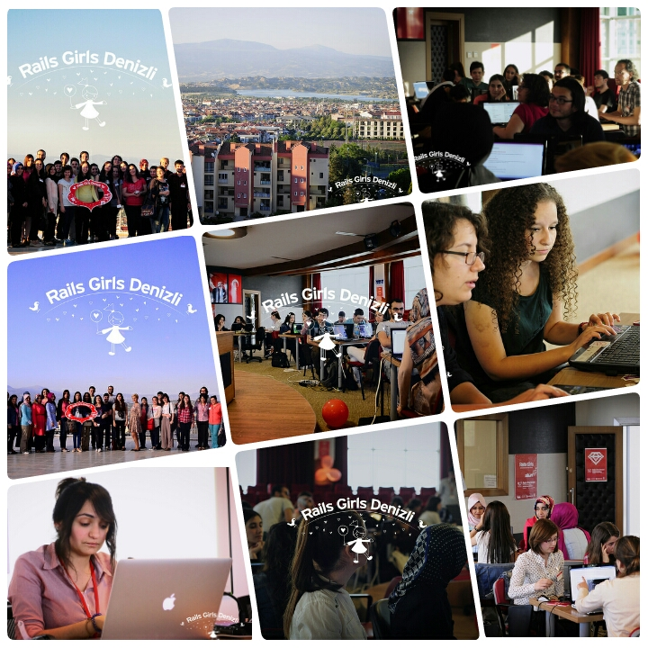

Rails Girls Finlandiya’da kurulmuş bir topluluktur. Amacı Rails kodlayan kadın sayısını artırmaktır.
Rails Girls topluluğu birçok ülkede başarılı projelere imza atmaktadır. Ülkemizde daha önce 2013 Ekim ayında
[Rails Girls İstanbul](http://railsgirls.com/istanbul), 2014 Mart ayında da [Rails Girls Ankara](http://railsgirls.com/ankara), 2014 Mayıs ayında [Rails Girls Denizli](http://railsgirls.com/denizli) etkinlikleri
düzenlenmiştir. Türkiye’de 4. kez düzenlenen Rails Girls etkinliği Denizli ’de ikinci kez düzenleniyor.
[Rails Girls Denizli](http://railsgirls.com/denizli2015) etkinliği 11 - 12 Aralık tarihleri arasında Pamukkale Teknokent Konferans salonunda gerçekleşecek.
Etkinliğe katılım ve bilgi almak için [railsgirls.com/denizli2015](http://railsgirls.com/denizli2015) adresini ziyaret edebilirsiniz.

Rails, Ruby programlama diliyle yazılmış, açık kaynak kodlu bir web uygulama geliştirme çerçevesidir.
Sade ve kısa bir sözdizimi sayesinde kullanıcı sayısı her geçen gün artmaktadır. Bu etkinliğin amacı her
yaştan kadının Rails’i tanıması, web dünyasını öğrenmesi ve küçük web uygulamaları yapabilmeleridir.
Bu uygulamalar sayesinde kadınlar kod yazmanın zor olmadığını farketmeye başlayacak ve ön yargılarından
kurtulacaklardır. Etkinliğe yanlarında bir kadının eşlik etmesi halinde konuyla ilgilenen erkeklerde katılabiliyor.

Rails Girls etkinliğini en güzel yanlarından birisi de Rails konusunda uzman kişilerin etkinlik sırasında
size mentorluk etmesi ve yönlendirmesi. Etkinliğe katılmak için programcılık bilgisine sahip olmanıza gerek yoktur.

11 - 12 Aralık 2015 tarihleri arasında Denizli’de gerçekleşecek olan [Pamukkale Teknokent](http://pauteknokent.com.tr/teknokent/) 'in
ev sahipliğini yaptığı, [lab2023](http://lab2023.com/) organizatörlüğünde ve sponsorların desteğiyle gerçekleşen, Rails girls etkinliğinin programı şu şekildedir.

- Cuma akşamı katılımcılar ve mentörler ile tanışma ve kurulum partisi yapılacaktır. Bu partide cumartesi günü neler yapılacağı
  anlatılacak ve katılımcıların bilgisayarlarına gerekli programların kurulması sağlanacaktır.

- Cumartesi günü ise eğitime başlanacak ve küçük uygulamalar yapılarak bir proje ortaya çıkarılacak.

Bu güzel etkinliğe son katılım tarihi, 6 Aralık 'tır.

Katılmak için [railsgirls.com/denizli2015](http://railsgirls.com/denizli2015) adresindeki formu doldurmanız yeterli.

---

[![railsgirlsdenizli] (../assets/images/articles/2015-12-02-rails-girls-denizli-etkinligi/railsgirlsdenizli2015.png)](http://railsgirls.com/denizli2015)

