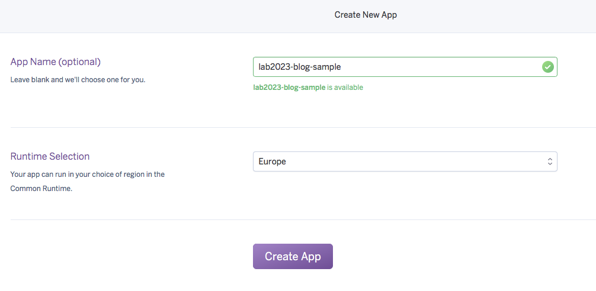
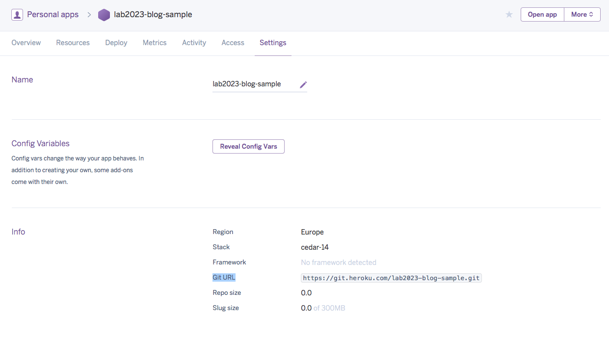

Merhaba,

Sizlere daha önceden rails uygulamanın yayına alınması yöntemlerinden biri olan kendi ubuntu sunucunuzda uygulamanın yayınlanması işlemini anlatmıştım. İlgili yazıya şu <a href="http://lab2023.com/ruby-on-rails-uygulamasinin-capistrano-3-ile-kolayca-yayinlanmasi.html">linkten</a> ulaşabilirsiniz.

Bu yazıda ise uygulamanın <a href="http://heroku.com" target="_blank">Heroku</a> servisi üzerinde, çoklu ortamlar(Staging, Production) için ayrı ayrı yayına alınması süreçlerinden ve her bir ortam için farklı git branch'lerinin kullanılması olayından bahsedeceğim.

Heroku üzerinde yayına alacağımız uygulamanın boş bir uygulama olması yerine bir kaç işlem yapabildiğimiz bir uygulama olması için <a href="https://github.com/lab2023/cybele/" target="_blank">Cybele</a> gem'ini kullanarak bir uygulama oluşturacağım. Kullandığım cybele versiyonu ise 1.9.2'dir.

Proje oluşturma adımı ile başlayacak olursak;

Terminalimizden cybele proje oluşturma komutunu çalıştırıyoruz;

```bash
    cybele blog
```

Daha sonrasında ise oluşturulan projemizin README.md dosyasında yeralan uygulama çalıştırılmadan önce yapılması gerekenleri yapıyoruz.
Bu işlemler ise;

* Proje dizininde yeralan .env.local değişkenlerini ayarlıyoruz.
Bu ayarlar içinde e-posta göndermek için kullandığımız SMTP ayarları olan aşağıda listelenen ayarlar bulunmaktadır.

```ruby
    SMTP_PASSWORD=your_password
    SMTP_USER_NAME=your_user_name
    SMTP_ADDRESS=smtp.sendgrid.net
```

Mail servisi olarak <a href="https://sendgrid.com" target="_blank">SendGrid</a> servisi size ücretsiz olarak aylık 12000 e-posta sağlamaktadır. Hobi projeleriniz için bu servisi kullanabilirsiniz. <a href="https://app.sendgrid.com/settings/credentials" target="_blank">Settings->Credentials</a> sayfasından gerekli username ve password'u alabilirsiniz.

* Hataları izleyebilmek için kullandığımız Rollbar servisinde aldığımız token'ı config/initializers/rollbar.rb dosyasında yer alan your_token yazan string ile değiştiriyoruz. Rollbar servisi üzerinde projenizi oluşturduğunuzda size doğrudan gerekli token'ı, yönergeleri ile birlikte verecektir.
* User ve Admin model'leri için db/migrate/*.rb  dizininde yeralan migration dosyalarındaki is_active alanının varsayılan değerini true olarak ayarlıyoruz.
* Projenin config/settings.yml dosyasında yeralan username ve password alanlarını değiştiriyoruz.
* Son olarakta projenin public dizini için VERSION.txt dosyası oluşturmak için şu komutu çalıştırıyoruz;

```bash
    ln -s ../VERSION.txt VERSION.txt
```

Projemizde bu ayarları yaptıktan sonra, uygulamayı çalıştırma işlemlerine geçiyoruz. Bu adımda ise şu komutları sırasıyla çalıştırıyoruz.

```bash
    bundle
    redis-server
    rake sidekiq:start
    rake db:create
    rake db:migrate
    rake dev:seed
    rails server
```

Çalışan uygulamanın ekran görüntüsü aşağıdaki resimdeki gibi elde edilecektir.

[]()

Ayrıca localhost:3000/hq url'linden de uygulamanın yönetici bölümüne erişebilirsiniz. Yönetici giriş bilgileri db/seeds.rb dosyasında yer almaktadır.

Buraya kadar normal olarak projemizi oluşturmuş olduk. Şimdi çoklu ortamlarda kullanmak için git'in efektif bir dallanma eklentisi olan <a href="http://danielkummer.github.io/git-flow-cheatsheet/" target="_blank">git-flow</a> ile ilgili ayarlara.
Projemizin kök dizininde tanımlamış olduğumuz git yanına git-flow'u tanımlıyoruz. Git'in master branchinde iken şu komut ile git-flow'u aktif hale getiriyoruz.

```bash
    git flow init
```

Bu komut sayesinde release kodlarımızın yani production ortamı için kullanılacak kodlarımız master branch'inde, development kodlarımız yani staging sunucusunda yayınlayacağımız kodlar develop branch'inde tutulacaktır.
Git-flow tanımlama işleminin ardından artık heroku üzerinde uygulama oluşturma bölümüne geçiyoruz.
Heroku üzerinde heabımızı oluşturup giriş yaptıktan sonra yeni bir uygulama oluşturuyoruz.

[]()

Oluşturduğumuz uygulamanın ismi eşsiz olmalıdır. Heroku size alt alanadı sağladığı için aynı isimli uygulamara izin vermemektedir.
Biz uygulama ismi olarak lab2023-blog-sample tercih ettik. Bu uygulama production ortamı için kullanacağımız kodları barındıracaktır.
Yukarıdaki adımları izleyerekten tekrar bir uygulama daha oluşturuyoruz. Bu uygulama ise staging ortamımız olacak ve develop branch'indeki kodlarımızı barındıracağız.
Staging ortamı için uygulama ismi olarak staging-lab2023-blog-sample'ı tercih ettik.

Production ve Staging uygulamalarımızı oluşturduktan sonra bu iki uygulamaya da uygulamanın detaylar sayfasında bulunan Resources sekmesinden Heroku Postgres::Database, Logentries ve Redis To Go elementlerini şekilde ki gibi ekliyoruz.

[]()

Heroku Postgres::Database elementi PostgreSQL veritabanı için gereklidir.
Logentries elementi uygulama logları portal üzerinden analiz edebilmemiz için gereklidir.
Redis To Go elementi uygulama içinde kullandığımız Sidekiq arka plan işlerini gerçekleştirebilmemiz için gereklidir.

Uygulamamız için gerekli elementleri ekledikten sonra sıra geldi heroku uygulamalarımızın git ile ilgili ayarlarını yapma işlemine. Bu işlem için Production uygulamamız olan lab2023-blog-sample uygulamasının Detaylar sayfasından Settings sekmesine geliyoruz. Bu sayfada uygulama ile ilgili bir çok detayı bulabilirsiniz. Info bölümde yer alan Git URL alanındaki linki kopyalıyoruz.

[]()

Bu kopyaladığımız git url'i terminalden proje dizinimize gelerek, aşağıdaki komutu kullanarak ekliyoruz.

```bash
    git remote add production https://git.heroku.com/lab2023-blog-sample.git
```

Git komutlarında kullancağınız remote.production.url'in ayarlandığını görmek için, şu komutu kullanabilirsiniz.

```bash
    git config --list
```

Eğer yanlış bir url eklemesi yaptıysanız şu komutu kullanarak eklediğiniz url'i kaldırabilirsiniz.

```bash
    git remote remove production
```

Bu uyguladığımız adımlardan terminalden url eklemeye kadar olan adımları aynı şekilde staging uygulaması olan staging-lab2023-blog-sample için de yapıyoruz.
Terminalden git url'i ekleme bölümünde ise şu şekilde ki komutu çalıştırıyoruz.

```bash
    git remote add staging https://git.heroku.com/staging-lab2023-blog-sample.git
```

Bu işlemlerden sonra artık uygulamamızın heroku urllerini de eklenmiş olduk.

Şimdi staging uygulamamıza kodları gönderme kısmına gelelim.
Bu işlemi yapabilmek için heroku uygulamalarına erişimimiz olması gerekmektedir. Heroku sunucularına, git ile uygulama kodlarını gönderebilmek için heroku komutları ile login olmalıyız. Heroku komutlarının kullanılabilmesi için ise <a href="https://toolbelt.heroku.com" target="_blank">Heroku Toolbelt</a> kurulumunu yapmalısınız.

Kurulum yapıldıktan sonra şu komut ile heroku hesabınıza giriş yapabilirsiniz;

```bash
    heroku login
```

Giriş yaptıktan sonra staging uygulamamızı yayına almak için şu komutu kullanıyoruz;

```bash
    git push staging develop:master
```

Bu komutta develop:master ile yapılmak istenen develop branch'indeki kodlar heroku üzerinde master branchine aktarılması işlemidir. Heroku uygulamaları master branch'te çalışmaktadır. Bu komutu çalıştırdıktan sonra uygulamamız artık heroku sunucusuna gönderilmiştir, şekilde gördüğünüz gibi.

[]()

Proje dizinimizde bulunan Procfile sayesinde bir web bir de worker dynosu çalıştırılabilir duruma gelmiştir. Web dynosu varsayılan olarak direk çalıştırılmıştır. Worker'ı ise uygulama detay sayfasında Resources sekmesinde bulunan sayfadan açmamız gerekmektedir. Worker'ı da çalıştırdıktan sonra uygulamamızın son hali şekildeki gibidir.

[]()

Worker'larımızın sidekiq ayarları config/sidekiq.yml dosyasında bulunmaktadır. Burada production ortamı için concurrency: 25 olarak ayarlanmıştır. Redis To Go ücretsiz paketi düşük özelliklere sahip olduğu için 25 thread'e izin vermemektedir. Bunu 3 olarak ayarlarsak production ortamı içinde problem yaşamadan uygulamamızı yayınlamış oluruz.

Uygulamamızı sunucuya gönderdik ve web ile worker dynolarını çalışır hale getirdik. Şimdi heroku üzerinde veritabanı için migration dosyalarını koşma ve seed rake'lerini çalıştırma işlemine geçiyoruz.

```bash
    heroku run rake db:migrate --app staging-lab2023-blog-sample
    heroku run rake dev:seed --app staging-lab2023-blog-sample
```

Heroku uygulamasında rails console'a erişmek için gerekli komut;

```bash
    heroku run rake console --app staging-lab2023-blog-sample
```

Bu işlemlerden sonra .env.local dosyamızda tutduğumuz ENV değişkenlerinin heroku üzerinde ayarlanması işlemine geçeçek olursak, şu komut ile bu değişkenleri ayarlayabiliriz.

```bash
    heroku config:set SMTP_ADDRESS=smtp.sendgrid.net --app staging-lab2023-blog-sample
    heroku config:set SSMTP_USER_NAME=your_user_name --app staging-lab2023-blog-sample
    heroku config:set SMTP_PASSWORD=your_password --app staging-lab2023-blog-sample
    heroku config:set ROOT_PATH=https://staging-lab2023-blog-sample.herokuapp.com --app staging-lab2023-blog-sample
    heroku config:set BASIC_AUTH_IS_ACTIVE=yes --app staging-lab2023-blog-sample
```

Ayarlarınızı bu komutlar ile ayarladıktan sonra heroku üzerinde uygulamanın ayarlar sayfasında Config Variables bölümünde bu değişkenleri görebilirsiniz, ayrıca portal üzerinden de bu değişkenleri değiştirebilirsiniz. Herokuya rails uygulaması gönderildiğinde RAILS_ENV varsayılan olarak production olarak ayarlanıyor. RAILS_ENV değerini de staging ile değiştirebilirsiniz.

```bash
    heroku config:set RAILS_ENV=staging --app staging-lab2023-blog-sample
```

Şu komut ile de heroku üzerindeki değişkenlerinizi listeleyebilirsiniz;

```bash
    heroku config --app staging-lab2023-blog-sample
```

Şu komut ile çalışan dynolarınızı listeleyebilirsiniz;

```bash
    heroku ps --app staging-lab2023-blog-sample
```

Şu komut ile dynolarınızı(web, worker) yeniden başlatabilirsiniz;

```bash
    heroku ps:restart --app staging-lab2023-blog-sample
```

Komut bilgilerinin ardından production ortamında uygulamamızı yayınlama işlemine gelecek olursak; Şu anda master branch'imizde herhangi bir release kodu bulunmamakta. Git-flow'dan yararlanarak v1.0.0 etiketi ile bir versiyon yayınlayalım.
Bu işlem için gerekli olan komutlar şunlardır;

```bash
    git flow release start v1.0.0
    git flow release finish v1.0.0
```

Git-flow sayesinde çıkardığımız ilk release'i lab2023-blog-sample heroku uygulamamıza göndermek için gerekli komut;

```bash
    git push production master
```

Uygulamamızı production ortamına gönderdik sonra aynı staging ortamında olduğu gibi diğer komutları uygulamaya özel olarak çalıştırıyoruz.

```bash
    heroku run rake db:migrate --app lab2023-blog-sample
    heroku run rake dev:seed --app lab2023-blog-sample
    heroku config:set SMTP_ADDRESS=smtp.sendgrid.net --app lab2023-blog-sample
    heroku config:set SSMTP_USER_NAME=your_user_name --app lab2023-blog-sample
    heroku config:set SMTP_PASSWORD=your_password --app lab2023-blog-sample
    heroku config:set ROOT_PATH=https://lab2023-blog-sample.herokuapp.com --app lab2023-blog-sample
    heroku config:set BASIC_AUTH_IS_ACTIVE=no --app lab2023-blog-sample
    # Tek seferde bütün ayarları yapmak isterseniz şu komutu kullanabilirsiniz
    heroku config:set SMTP_ADDRESS=smtp.sendgrid.net SSMTP_USER_NAME=your_user_name SMTP_PASSWORD=your_password ROOT_PATH=https://lab2023-blog-sample.herokuapp.com BASIC_AUTH_IS_ACTIVE=no --app lab2023-blog-sample
```

Uygulamamız da ilk kez bu komutları çalıştırdıktan sonra yeni değişiklikleri sunucuya göndermek için kullanacağımız komutlar;

Staging ortamı için;

```bash
    git push staging develop:master
```

Production ortamı için;

```bash
    git push production master
```

Eğer yeni migration dosyalarınız veya çalıştırmanız gereken özel rake'ler varsa yukarıdaki komutlardaki gibi uygulamayı belirterek çalıştırmanız yeterlidir.

Gemfile dosyanızda özel github repolarınız varsa bu repolara heroku uygulamanızın erişebilmesi için herokuya özel oluştruduğunuz ssh keylerinizi şu komut ile herokuya ekleyebilirsiniz;

```bash
    heroku keys:add ~/.ssh/heroku_id_rsa.pub
```

Sık ihtiyac duyabileceğiniz bazı komutların listesi aşağıdaki gibidir;

```bash
    # Web dynonusunu yeniden başlatır
    heroku ps:restart web
    # Worker dynonusunu yeniden başlatır
    heroku restart worker
    # Yapılması gereken ağır işleri farklı dyno büyüklüklerinde çalıştırmak isterseniz
    heroku run --size=standard-2x rake heavy:job
    heroku run --size=performance-l rake heavy:job
    # Uygulama loglarını terminalden izleyebilmeniz için
    heroku logs
    heroku logs --tail
    heroku logs --source app --tail
    # Uygulamanın veritabanı bilgilerini listelemek isterseniz
    heroku pg
    # Uygulamanın veritabanı yedek alma zaman planı
    heroku pg:backups schedules
    # Uygulamanın veritabanın düzenli olarak yedek almasını istiyorsanız
    heroku pg:backups schedule --at '04:00 Europe/Istanbul'
```

Örnek uygulamaya şu <a href="https://lab2023-blog-sample.herokuapp.com/" target="_blank">linkten</a> ulaşabilirsiniz.
Örnek kaynak kodlar ise şu <a href="https://github.com/ismailakbudak/lab2023-blog-sample" target="_blank">linkten</a> ulaşabilirsiniz.

Umarım faydalı bir yazı olmuştur.
İyi çalışmalar..