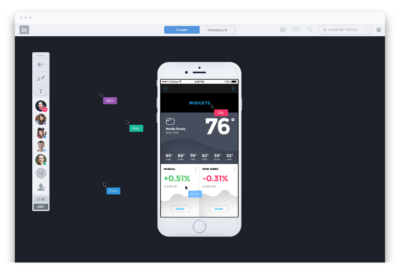

Merhaba,

Front-end ve Back-end geliştiricilerin ağırlıklı kullandığı github, gitlab, bitbucket gibi araçlar, birlikte çalışma 
ortamı yaratarak kendilerini collaborative (işbirliği) ile geliştirme ortamı yaratma konusunda etkili, verimli sistemlerdir.

Arayüz tasarımcılarını ele aldığımızda karşımıza, tasarlama, tasarımı teslim etme ve tasarımı geliştirme adına geliştiriciler 
ve firmalar için hayatı kolaylaştırma adına uygulamalar karşımıza çıkıyor. Bunlardan en fazla işimize yarayabilecekleri birlikte 
inceleyerek uygun platformu seçebiliriz.

## 1. InvisionApp

İnvisionapp diğer uygulamalara göre biraz daha kendini geliştirmiş diyebiliriz. Yaptığı işler ile adından söz ettirmemesi 
sürpriz olurdu.

3 ayrı özellik prototyping, collaboration ve workflow platformu olarak ele almamız doğru olur.Invision üzerinden tasarım 
yapabilirken, aynı zaman da çalışma arkadaşlarınız ile birlikte çalışmanın herhangi bir noktasına yorum bırakabiliriz.

Bu platformun güzel tarafı realtime olarak collaboration sunması. Board kullanarak tasarımlarınızı, tüm takım arkadaşları 
ile birlikte editleme ve yorumlama imkanınız oluyor.Ayrıca  tüm tasarım sayfalarınızı tek bir layout üzerinde sunum dosyası 
oluşturarak inceleyebilirsiniz. Built-in layout sistemi yardımıyla tüm tasarımı styleguide ile birlikte sunum haline getirerek, 
takım arkadaşlarınıza görsel bir zenginlik sağlar.

Diğer bir yandan **dropbox, drive, slack, basecamp, trello, jira, github, hipchat** gibi platformlar ile uyumlu çalışarak 
push & pull işlemini otomatik olarak sizin yerinize gerçekleştirir.

Başlangıç paketine yıllık üyelik durumunda %10 indirimle ayda 13 dolar, team paketine yine aynı kural dahilinde 89 dolardan 
sahip olabilirsiniz.

## 2. Redpen.io

Redpen, collaboration platformları arasında özellikleri bakımından kısıtlı ama bir o kadar hızlı uygulamadır.

Drag&drop özelliği ile projelerinizi kolayca platforma entegre edebilir, proje olarak klasörleyebilir, işlerinizi daha 
organize yönetebilirsiniz.

Diğer platformlarda olduğu gibi redpen de realtime olarak takım yorumları ve incelemesinde bulunabilirsiniz. 
Üzerinde herhangi bir düzenlemeye izin vermediği için müşterilere tasarımlarınızı sunabilirsiniz.Yapılan comment 
altına istediğiniz kadar comment atabilme imkanınız da bulunuyor.Fakat unutmayın redpen size 2 haftalık deneme sürümü sunuyor.
Proje bazlı fiyatlandırması olan platform 20 dolar gibi başlangıç fiyatıyla rakiplerine biraz fazla şans tanıyor gibi. 

## 3. Zeplin

Sunduğu özellikler bakımından aralarında en hızlı, kolay ve kullanışlı gördüğüm platform diyebiliriz.Tasarımları teslim 
ederken size sunduğu özellikler cezbedebilir, aynı zamanda çalışmalarınızda da büyük kolaylık sağlayabilir.

Hem Sketch hem de Photoshop ile yaptığınız tasarımları kolayca senkronize ederek export edebilirsiniz.

Bir diğer iyi yanı, tasarımda kullanılan assets, bitmap ve style özelliklerini çalışma arkadaşlarınız ile paylaşarak 
çalışma ortamına aktarabilirsiniz.

Diğer platformlarda olduğu gibi bu platform da comment özelliği ile takım olarak tasarımı inceleme olanağına sahip.

Front-end geliştiricileri de düşünerek tasarım üzerinde seçtiğiniz objenin HTML/CSS (css,sass,less,stylus vb.) 
kodlarını görebilmeniz mümkün.

Yakın zamanda yayınladıkları yeni özellik versiyonlama ile zaman içinde export edilen dosyaların saklanmasında 
yardımcı oluyor.

Tek bir proje üzerinde çalışma yapmak isteyenler için Zeplin ücretsiz destek veriyor fakat 3 proje için 
17, 12 proje için 26 dolar gibi bir fiyatlandırması mevcut.Ekip ya da firma olarak kullanmak isterseniz kullanıcı 
başına 6-7 dolar civarı bir miktar yeterli oluyor.

Bir sonraki yazıda Wake ve Lingoapp üzerine inceleme yapacağız.