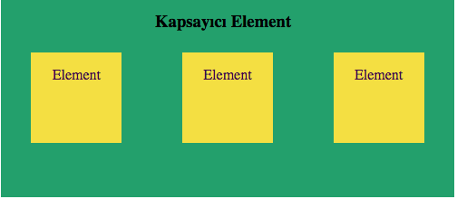

Merhaba;

Sizlere Css'in elementleri kontrol etmek için kullanılan 'display' özelliğinden 
bahsedeceğim. Bu özellik ile Html elementlerinin yerleşimleri ve görünümleri ile
 ilgili düzenlemeler yapabilirsiniz. Display özelliği geliştiriciler için temel sayfa düzenlerinin sağladığı tasarımlardan
 çok daha fazlasını sunar.

    Html elemetleri sayfadaki yerleşimlerine göre satır ve blok seviyesi olarak iki gruptan oluşur. Bu özellikler
elementlerde varsayılan olarak bulunur.

 
### Display: Inline Özelliği

   Inline özelliğine sahip elementler yeni satır başlatmazlar. Diğer elementlerle aynı hizada, yan yana görünürler. 
Sadece kendi içeriği kadar yer kaplar. Bu elementlere yükseklik ve genişlik verilemez. 

Default olarak inline özelliğine sahip bazı elementler;

    

    

    <li> span   </li>
    <li> a</li>
    <li> img</li>
    <li> b</li>
    <li> big</li>
    <li> i</li>
    <li> small</li>
    <li> code</li>
    <li> em</li>
    <li> strong</li>
    

    

    <li> br</li>
    <li> map</li>
    <li> object</li>
    <li> button</li>
    <li> script</li>
    <li> sub</li>
    <li> input</li>
    <li> label</li>
    <li> select</li>
    <li> textarea</li>
    

 

### Display: Block Özelliği

   Block özelliğine sahip elementler bir önceki elementin satır sonu ile başlar ve bulundukları yerin tüm genişliğine 
   sahip olurlar. Yükseklik, genişlik, kenar boşlukları gibi özellikler değiştirilebilir.
   
Default olarak block özelliğine sahip bazı elementler;

    

    

    <li> address</li>
    <li> p </li>
    <li> section</li>
    <li> article</li>
    <li> br </li>
    <li> section</li>
    <li> header</li>
    <li> h1,h2,h3,h4,h5,h6</li>
    <li> hr</li>
    <li> li</li>
    

    

    <li> main</li>
    <li> nav</li>
    <li> video</li>
    <li> table</li>
    <li> div</li>
    <li> form</li>
    <li> footer</li>
    <li> blockqoute</li>
    <li> output</li>
    <li> aside</li>
    

 
### Display:None Özelliği

Bu özellik genellikle Javascript ile elementleri gizlemek ya da göstermek için kullanılır.
Bu özelliği verdiğiniz element sayfada görünmeyecektir.  

 
### Display: inline-block Özelliği

  İnline-block özelliği, element için satır ve blok elementi özelliklerinin bir arada kullanımını sağlar.
Satır içi olan elemente inline-block özelliğini verdiğinizde yükseklik ve
 genişlik verebilirsiniz. Yani satır elementlerine block elementlerinin özelliklerini, block
  elementlerine ise satır elementlerinin özelliklerini verebilirsiniz.
  
 
### Display: flex Özelliği  

 

Flex, kapsayıcı element ve o elementin içindeki elementlere etki eder. Flex özelliğini verdiğiniz element 
 kapsayıcı element olacaktır ve o elementin içindeki elementleri flex yerleşimine zorlayacaktır.
 
### flex: direction
 
 Flex özelliğinin kapsadığı elementlerin yatay ve dikey olarak hizlanmasını sağlar.
 
 * **flex-direcion: row**  elementleri yatayda soldan sağa hizalar.
 * **flex-direcion: column** elementleri dikeyde yukarıdan aşağıya hizalar.
 * **flex-direcion: row-reverse** elementleri yatayda sağdan sola hizalar.
 * **flex-direcion: column-reverse** elementleri dikeyde aşşağıdan yukarıya hizalar.
 
### flex: wrap 
    
Kapsayıcı elementin genişliğini aştığında, içindeki elementlerin nasıl yerleşeceğini belirtmek için kullanılır.

* **flex-wrap: nowrap**, genişliği aştığında aynı satırda devam eder.
* **flex-wrap: wrap**, genişliği aştığında alt satıra geçer.
* **flex-wrap: wrap-reverse**, genişliği aştığında üst satıra geçer.

Flex elementinin sahip olduğu daha birçok özellik bulunur. Bu yazıda 
şimdilik en çok kullanılanlardan bahsettim. Daha fazlası için [buradan](https://www.w3schools.com/cssref/css3_pr_flex.asp) incelemeye devam edebilirsiniz.

Kolay gelsin.
